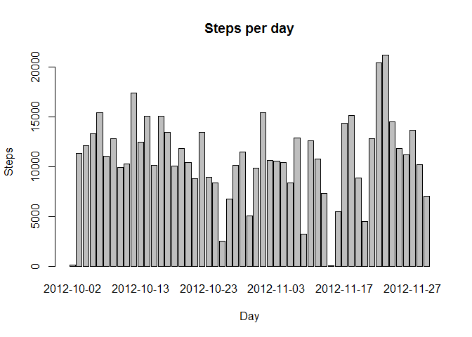
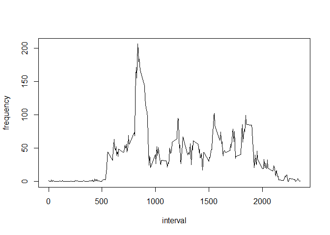
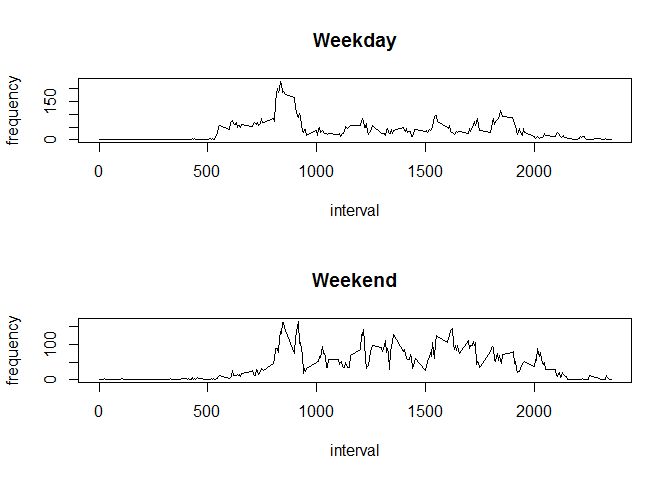

# Reproducible Research: Peer Assessment 1
Pablo Rodríguez  


## Loading and preprocessing the data

We can unzip and load directly using unz:  


```r
data <- read.csv(unz("activity.zip", "activity.csv"))
```

It's always useful to take a look at the data:  


```r
head(data)
```

```
##   steps       date interval
## 1    NA 2012-10-01        0
## 2    NA 2012-10-01        5
## 3    NA 2012-10-01       10
## 4    NA 2012-10-01       15
## 5    NA 2012-10-01       20
## 6    NA 2012-10-01       25
```


## What is mean total number of steps taken per day?

First of all, we exclude the missing values from our data:  


```r
cleanData <- data[!is.na(data$steps), ]
```

Create a new dataframe summarizing the total number of steps for each day:  


```r
stepsPerDay <- aggregate(cleanData$steps, by = list(cleanData$date), FUN = sum)
colnames(stepsPerDay) <- c("date", "steps")

head(stepsPerDay)
```

```
##         date steps
## 1 2012-10-02   126
## 2 2012-10-03 11352
## 3 2012-10-04 12116
## 4 2012-10-05 13294
## 5 2012-10-06 15420
## 6 2012-10-07 11015
```

With this clean data, we can easily create an histogram:  


```r
barplot(stepsPerDay$steps, xlab = 'Day', ylab = 'Steps', main = 'Steps per day', names.arg = stepsPerDay$date)
```

 

Finally, calculate the mean:  


```r
mean <- mean(stepsPerDay$steps)
mean
```

```
## [1] 10766.19
```

And the median:  


```r
median <- median(stepsPerDay$steps)
median
```

```
## [1] 10765
```

## What is the average daily activity pattern?

Extract the daily data and plot it:  


```r
dailySteps <- aggregate(cleanData$steps, by = list(cleanData$interval), FUN = mean)
colnames(dailySteps) <- c("interval", "mean")
plot(dailySteps, type = "l", xlab = "interval", ylab = "frequency")
```

 

Extract the maximum value:  


```r
maxIndex <- which.max(dailySteps$mean)
maxInterval <- dailySteps[maxIndex, 1]
maxInterval
```

```
## [1] 835
```


## Imputing missing values

We need to count the missing values:  


```r
numMissing <- sum(is.na(data$steps))
numMissing
```

```
## [1] 2304
```

Replace the nans with zeros:  


```r
filledIn <- data
filledIn <- merge(filledIn, dailySteps) # This appends the means per interval

nans <- is.na(filledIn$steps) # Substitute the nans with means per interval
filledIn[nans, 2] <- filledIn[nans, 4] 
```

## Are there differences in activity patterns between weekdays and weekends?

Extract the day of the week: 


```r
dayName <- weekdays(as.Date(filledIn$date))
```

And append a new column containing information about the weekend status of each day:  


```r
weekend <- dayName == "sábado" | dayName == "domingo" # Please note I work on a spanish pc
filledIn <- cbind(filledIn, weekend)
```

Finally, plot the data for both cases:  


```r
weekdayData <- filledIn[filledIn$weekend == FALSE, ]
weekendData <- filledIn[filledIn$weekend == TRUE, ]

weekdayMean <- aggregate(weekdayData$steps, by = list(weekdayData$interval), FUN = mean)
weekendMean <- aggregate(weekendData$steps, by = list(weekendData$interval), FUN = mean)

colnames(weekdayMean) <- c("interval", "steps")
colnames(weekendMean) <- c("interval", "steps")

par(mfrow = c(2,1))
plot(weekdayMean$interval, weekdayMean$steps, type = 'l', xlab = "interval", ylab = "frequency", main = "Weekday")
plot(weekendMean$interval, weekendMean$steps, type = 'l', xlab = "interval", ylab = "frequency", main = "Weekend")
```

 

